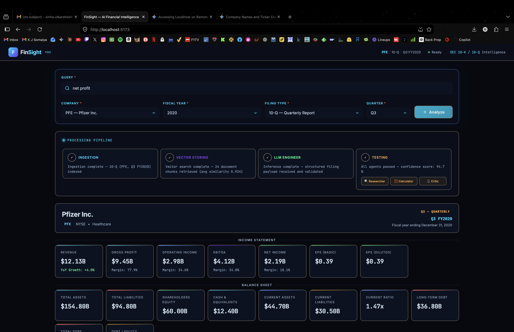
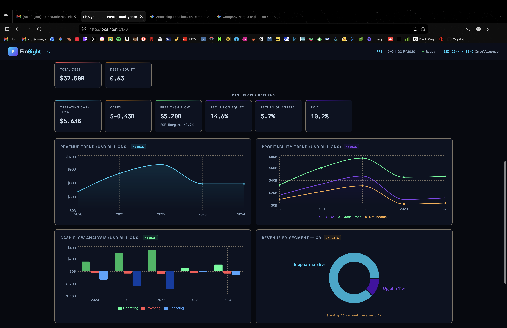
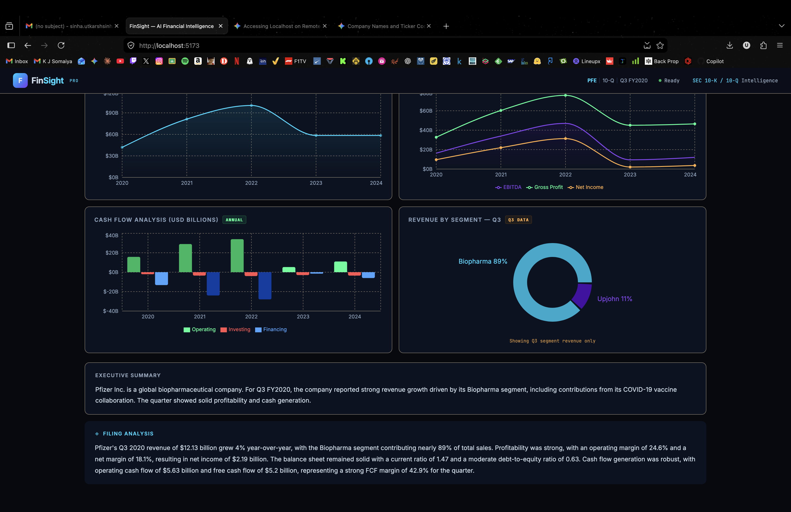

# FinSight

FinSight is a financial filing intelligence project for automated analysis of SEC 10-K and 10-Q reports. It combines a multi-stage Python analysis pipeline, retrieval-oriented data processing, and a React dashboard that renders structured financial outputs for company-level exploration.

The repository is organized as one end-to-end project: ingestion and retrieval logic live under `src/`, the web service layer lives under `backend/`, and the user-facing analytics interface lives under `frontend/`.

## What The Project Does

- Processes SEC filing documents into retrieval-ready chunks
- Preserves both narrative text and table-heavy financial sections
- Uses a multi-step agent flow for retrieval, analysis, calculation, and validation
- Produces a structured financial payload for dashboard rendering
- Visualizes summary metrics, trends, and segment distributions in a connected frontend

## System Architecture

FinSight is built around a pipeline with four major layers:

1. Document ingestion and sanitization
2. Vector indexing and metadata-aware retrieval
3. Multi-agent reasoning and validation
4. Frontend delivery through a FastAPI-backed dashboard flow

### High-Level Flow

```text
SEC Filings -> Parsing + Chunking -> Embeddings -> Qdrant Retrieval
           -> LangGraph Agent Flow -> Structured Financial Payload
           -> FastAPI Service -> React Dashboard
```

## Core Technical Components

### 1. Ingestion Pipeline

The ingestion layer in [`src/ingestion.py`](/Users/utkarsh/Desktop/FinSight/src/ingestion.py) is responsible for converting raw SEC filing artifacts into LangChain `Document` objects.

Key implementation details:

- Supports HTML and PDF filing inputs
- Uses `unstructured` partitioning to separate tables from narrative text
- Converts table content into markdown-like text so row and column relationships are not lost
- Infers metadata from filing directory structure, including ticker, filing type, year, and source path
- Uses `RecursiveCharacterTextSplitter` with chunk overlap for long-form narrative sections
- Maintains a checkpoint file to avoid reprocessing already ingested filings

This matters because SEC filings are noisy, markup-heavy, and often dominated by tables, footnotes, and repeated section headers. The ingestion layer reduces that noise before retrieval.

### 2. Vector Store and Retrieval

The retrieval layer in [`src/vector_store.py`](/Users/utkarsh/Desktop/FinSight/src/vector_store.py) uses local Qdrant storage with Hugging Face embeddings.

Technical details:

- Embedding model: `BAAI/bge-large-en-v1.5`
- Embedding dimension: `1024`
- Similarity metric: cosine distance
- Local persistent Qdrant path configurable through environment variables
- Batch indexing support for chunk ingestion
- Metadata filters for ticker, filing type, and year
- Optional table prioritization for numeric and ratio-heavy questions

The retrieval function is designed to bias toward table chunks when a query appears financial or calculation-focused, which helps surface structured filing evidence earlier in the pipeline.

### 3. Multi-Agent Orchestration

The reasoning engine in [`src/agent.py`](/Users/utkarsh/Desktop/FinSight/src/agent.py) uses LangGraph to coordinate specialized nodes:

- `researcher`: rewrites the user request into a retrieval-optimized search query
- `analyst`: reads retrieved filing chunks and extracts direct answers or calculation inputs
- `calculator`: evaluates expressions separately to reduce arithmetic hallucinations
- `critic`: checks whether the proposed answer is sufficiently supported by the retrieved context

Routing behavior:

- If retrieval is weak, the graph loops back to the researcher
- If a calculation is needed, the analyst routes to the calculator
- If the answer is unsupported, the critic triggers a retry cycle
- If retries are exhausted, the system resolves to `INSUFFICIENT_DATA` instead of fabricating an answer

This is an important design choice: the project is not just prompting a model once. It is structured as a stateful reasoning pipeline with explicit self-correction.

### 4. Local LLM Engine

The model runtime in [`src/llm_engine.py`](/Users/utkarsh/Desktop/FinSight/src/llm_engine.py) is configured around the Gemma 4 family described in the project documentation.

Current technical characteristics:

- Model ID comes from config and defaults to `google/gemma-4-E4B-it`
- Loaded through Hugging Face `transformers`
- Uses `torch.bfloat16`
- Uses Flash Attention 2
- Uses `device_map="auto"`
- Wrapped as a LangChain-compatible `HuggingFacePipeline`

This keeps the analysis stack aligned with the repository’s documented local-model design.

### 5. Web Service Layer

The web layer in [`backend/main.py`](/Users/utkarsh/Desktop/FinSight/backend/main.py) exposes the dashboard-facing request flow.

What it handles:

- Request validation for ticker, year, filing type, and quarter
- Stepwise streaming progress updates using server-sent events
- Delivery of a schema-aligned financial payload to the frontend
- Health endpoint for basic service verification

The backend is structured to match the frontend contract cleanly, so the dashboard can render filing outputs, progress states, and charts without additional transformation logic.

### 6. Frontend Dashboard

The React dashboard in [`frontend/src/App.tsx`](/Users/utkarsh/Desktop/FinSight/frontend/src/App.tsx) is designed as a filing analysis workspace rather than a static landing page.

Frontend capabilities:

- Company, year, filing type, and quarter selection
- Query submission with validation states
- Real-time pipeline step visualization
- Metric cards for income statement, balance sheet, cash flow, and returns
- Trend charts for revenue, profitability, and cash flows
- Segment revenue visualization
- Narrative summary and filing analysis panels

Main UI modules:

- [`frontend/src/components/PipelineSteps.tsx`](/Users/utkarsh/Desktop/FinSight/frontend/src/components/PipelineSteps.tsx)
- [`frontend/src/components/MetricsGrid.tsx`](/Users/utkarsh/Desktop/FinSight/frontend/src/components/MetricsGrid.tsx)
- [`frontend/src/components/Charts.tsx`](/Users/utkarsh/Desktop/FinSight/frontend/src/components/Charts.tsx)
- [`frontend/src/components/AnalysisPanel.tsx`](/Users/utkarsh/Desktop/FinSight/frontend/src/components/AnalysisPanel.tsx)

## Output Schema

FinSight is designed around a structured financial output rather than free-form prose alone. The payload includes:

- Company metadata
- Filing period metadata
- Financial statement metrics
- Return and liquidity ratios
- Five-year trend arrays
- Segment revenue breakdown
- Executive summary
- Deeper filing analysis

Examples of supported fields include:

- `revenue`
- `gross_margin`
- `ebitda`
- `net_income`
- `current_ratio`
- `debt_to_equity`
- `free_cash_flow`
- `roe`
- `roa`
- `roic`

This schema-first design makes the project suitable for dashboard rendering, testing, and downstream integration.

## Repository Layout

```text
FinSight/
├── backend/                      # FastAPI service layer
├── docs/images/                  # README screenshots
├── frontend/                     # React + Vite dashboard
├── notebooks/                    # exploration notebooks
├── src/                          # ingestion, retrieval, prompts, agents, llm engine
├── tests/                        # unit tests
├── Finsight_Master_Project_Documentation.md
├── config.py
├── requirements.txt
└── start.sh
```

## Tech Stack

### Backend / ML

- Python
- FastAPI
- LangChain
- LangGraph
- Qdrant
- Hugging Face Transformers
- PyTorch
- `unstructured`
- `markdownify`

### Frontend

- React
- TypeScript
- Vite
- Recharts

## Screenshots

### Dashboard Overview



### Analysis View



### Pipeline Flow



## Local Development

### Backend

```bash
cd backend
python3 -m venv .venv
source .venv/bin/activate
pip install -r requirements.txt
uvicorn main:app --reload
```

### Frontend

```bash
cd frontend
npm install
npm run dev
```

The Vite development server proxies `/api` requests to `http://localhost:8000`.

## Tests And Verification

The repository includes Python-side tests for:

- agent routing behavior
- ingestion behavior
- vector store utilities

During the cleanup and integration pass, the following checks were run successfully:

- `python3 -m compileall backend src`
- `npm run build` in `frontend/`

## Documentation Reference

The master architecture reference for the project is stored in [`Finsight_Master_Project_Documentation.md`](/Users/utkarsh/Desktop/FinSight/Finsight_Master_Project_Documentation.md). It describes the intended hardware profile, ingestion strategy, multi-agent reasoning design, and output schema in more detail.
